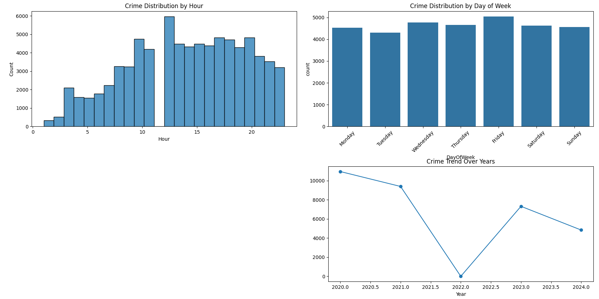
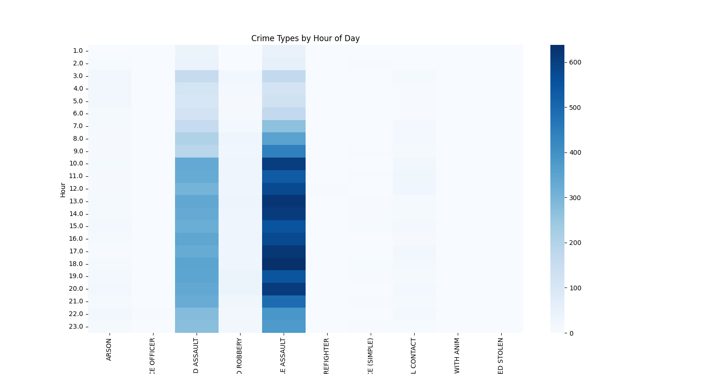

# Comprehensive Crime Data Analysis Using Python

This repository contains a Python-based tool for performing comprehensive analysis on crime datasets. It includes modules for temporal, spatial, demographic, and categorical crime data analysis, utilizing advanced visualization and geospatial mapping techniques.

---

## Features

- **Data Cleaning and Preparation**: Automated data parsing and cleaning for seamless analysis.
- **Temporal Analysis**: Crime distribution across time (hour, day, month, and year).
- **Crime Type Analysis**: Identification of most common crime types and their temporal patterns.
- **Victim Demographics**: Insights into victim age, gender, and descent distributions.
- **Spatial Analysis**: Heatmaps and area-based visualizations to identify high-crime zones.
- **Weapon Usage Analysis**: Analysis of weapon types commonly used in reported crimes.
- **Interactive Heatmaps**: Geospatial mapping using Folium for dynamic exploration of crime hotspots.

---

## Installation

1. Clone the repository:
   ```bash
   git clone https://github.com/your-username/Crime-Data-Analysis.git
   cd Crime-Data-Analysis
2. Install the required dependencies:
```bash
   pip install -r requirements.txt
```
3. Place the crime dataset in the Datasets folder and ensure the file path matches in the `script.py`.

---

## Usage

1. **Run the script**:
   - Open a terminal or command prompt and execute the following command:
     ```bash
     python script.py
     ```

2. **Analyze Outputs**:
   - The script generates various visualizations directly in your console or Jupyter Notebook environment:
     - Temporal crime trends (hourly, daily, monthly, yearly).
     - Top 10 crime types and their temporal patterns.
     - Victim demographic distributions (age, gender, descent).
     - Crime distribution by area and heatmaps for spatial patterns.
     - Common weapons used in crimes.
   - Interactive heatmaps are generated using Folium and displayed in your default web browser.

3. **Modify Configurations**:
   - To adapt the script for your dataset:
     - Update the file path in `FILE_PATH` at the beginning of the script.
     - Ensure the dataset includes the required columns mentioned in the "Example Dataset" section.

4. **Output Insights**:
   - Use the generated visualizations and maps to:
     - Identify crime hotspots.
     - Understand demographic trends.
     - Analyze patterns for specific crime types and times.

5. **Customization**:
   - The script is modular, so you can:
     - Add or modify analyses by editing the respective function (e.g., `temporal_analysis`, `victim_analysis`).
     - Extend functionality for additional datasets or specific analyses.

---

## Code Overview

### `script.py`

- **Functions**:
  - `load_and_clean_data(file_path)`: Loads and preprocesses the dataset.
    - Converts date columns to `datetime`.
    - Calculates reporting delays.
  - `temporal_analysis(df)`: Analyzes temporal patterns in crimes.
    - Generates visualizations for hourly, daily, monthly, and yearly crime trends.
  - `crime_type_analysis(df)`: Explores most common crime types.
    - Identifies the top 10 crime types and their occurrence patterns by hour.
  - `victim_analysis(df)`: Studies victim demographics.
    - Analyzes victim age, gender, and descent distributions.
  - `location_analysis(df)`: Maps crimes spatially and analyzes area patterns.
    - Creates heatmaps using Folium and visualizes crime counts by area.
  - `weapon_analysis(df)`: Examines patterns in weapon usage.
    - Identifies the top 10 most common weapons used in crimes.

- **Main Script**:
  - Automatically processes the dataset and performs all analyses.
  - Displays visualizations and statistical summaries.
  - Outputs interactive maps for spatial exploration.

---

## Example Dataset

Ensure your dataset contains the following columns for optimal performance:
- `Date Rptd`: Date the crime was reported.
- `DATE OCC`: Date the crime occurred.
- `TIME OCC`: Time the crime occurred (format: HHMM).
- `Crm Cd Desc`: Description of the crime committed.
- `Vict Age`: Age of the victim.
- `Vict Sex`: Gender of the victim.
- `Vict Descent`: Descent (ethnicity/race) of the victim.
- `LAT`, `LON`: Latitude and Longitude coordinates of the crime location.
- `AREA NAME`: Name of the area where the crime occurred.
- `Weapon Desc`: Description of the weapon used.

Sample data path: `Datasets/Crime_Data.csv`

---

## Requirements

- **Python Version**: Python 3.7 or higher.
- **Libraries**:
  - `pandas`: For data manipulation and cleaning.
  - `numpy`: For numerical computations.
  - `matplotlib`: For creating visualizations.
  - `seaborn`: For advanced statistical plots.
  - `folium`: For interactive heatmaps and geospatial analysis.

Install the required libraries using the following command:
```bash
pip install pandas numpy matplotlib seaborn folium
```

---

## Outputs

1. **Visualizations**:
   - Hourly, daily, monthly, and yearly crime trends presented as line plots, bar charts, and histograms.
     
   - Victim demographic insights:
     - Age distribution as a histogram.
     - Gender and descent distributions as count plots.
       
   - Crime type analysis:
     - Top 10 crime types as bar charts.
       
     - Heatmaps showing crime occurrence by time of day and type.
       

   - Spatial analysis:
     - Distribution of crimes across areas using bar charts.
     - Interactive heatmaps for crime hotspots created with Folium.
       
   - Weapon usage trends:
     - Top 10 most common weapons in crime incidents as bar charts.
       

2. **Interactive Maps**:
   - **Heatmaps**: Dynamic geospatial visualizations of crime hotspots using latitude and longitude data. These maps can be explored in your web browser.

3. **Statistical Summaries**:
   - Total number of crime incidents.
   - Date ranges for reported crimes.
   - Identification of missing values and their distribution across columns.

4. **Actionable Insights**:
   - Key takeaways from visualizations and statistical trends to support decision-making and public safety improvements.
  

---

## Contributing

Contributions are welcome! Here's how you can contribute:

1. Fork the repository.

2. Create a feature branch:
   ```bash
   git checkout -b feature/your-feature-name
   ```
3. Commit your changes:
   ```bash
   git commit -m "Add your message"
   ```
4. Push the branch to your forked repository:
   ```bash
   git push origin feature/your-feature-name
   ```
5. Open a pull request for review

---

## Acknowledgments
Special thanks to all contributors and open-source libraries that made this project possible.
